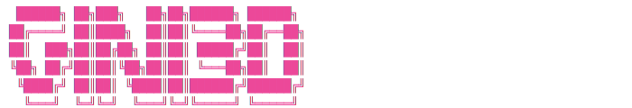

<picture>
  <source media="(prefers-color-scheme: dark)" srcset="assets/logo.svg">
  <source media="(prefers-color-scheme: light)" srcset="assets/logo.svg">
  
</picture>

# Gini3D - Adorable 3D Printed Creations

A cute 3D print marketplace run by **Nini & Gabby** (two 10-year-old best friends who love guinea pigs!). Built on [Nostr](https://nostr.com) with Bitcoin Lightning payments.

## Features

- 📦 **NIP-99 Product Listings** - Decentralized product catalog from Nostr relays
- ⚡ **Bitcoin Lightning Payments** - Fast, low-fee payments via Lightning Network
- 🔐 **NIP-07 Login** - Sign in with browser extensions (Alby, nos2x)
- 🏪 **Pre-selected Sellers** - Curated 3D printing specialists on Nostr
- 🛒 **Gamma Markets Checkout** - Kind 16/17 order processing

## Tech Stack

- ⚛️ **Framework**: Next.js 14+ (App Router)
- 🎨 **Styling**: TailwindCSS + shadcn/ui
- 🔮 **Nostr**: nostr-tools
- 📋 **Protocol**: NIP-99 (kind 30402) + Gamma Markets spec

## Getting Started

```bash
# Install dependencies
bun install

# Run development server
bun dev

# Format code
bun format

# Check formatting
bun format:check

# Lint code
bun lint

# Type check
bun typecheck
```

Open [http://localhost:3000](http://localhost:3000) to see the site.

## Featured Sellers

We feature pre-selected sellers who specialize in 3D printing on Nostr:

- **Gini3D** - Cute & Colorful Prints (by Nini & Gabby)
- **Robotechy** - Bitcoin Hardware & 3D Prints (by Isaac, 15)

Want to sell on Gini3D? [Contact us](/contact)!

## Environment Variables

Create a `.env.local` file:

```env
NEXT_PUBLIC_GINI3D_NPUB=your_npub_here
NEXT_PUBLIC_GINI3D_PUBKEY=your_hex_pubkey_here
NEXT_PUBLIC_SELLER_WHITELIST=pubkey1,pubkey2,pubkey3
```

## License

MIT

---

🧡💜 Made with love by Nini & Gabby 💜🧡

⚡ Powered by Nostr and Bitcoin Lightning
